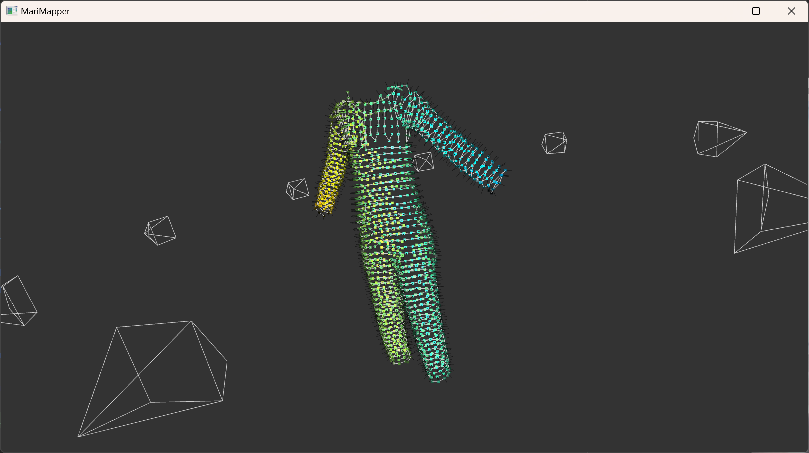
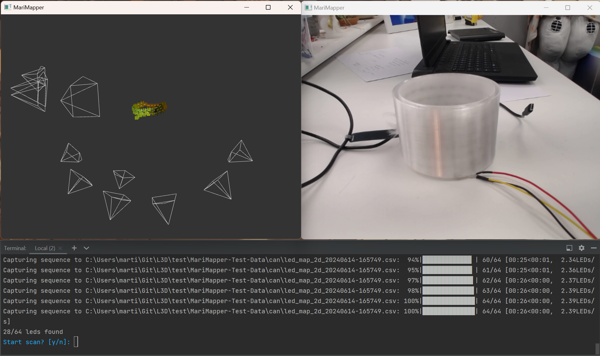

[]()
[](https://github.com/TheMariday/MariMapper/actions/workflows/test_windows.yml)
[](https://github.com/TheMariday/MariMapper/actions/workflows/test_ubuntu.yml)
[](https://github.com/TheMariday/MariMapper/actions/workflows/test_mac.yml)
[](https://github.com/psf/black)

> [!CAUTION]
> [This tool does not currently support Python 3.12](https://github.com/TheMariday/marimapper/issues/27)


### Marimapper uses your webcam to map addressable LEDs to 3D space!



Above example data folder can be found under [docs/highbeam_example/](docs/highbeam_example)

## Step 0: Install

```shell
pip --version # Ensure that it is //not// python 3.12, see above
pip install pipx
pipx ensurepath
pipx install "git+https://github.com/themariday/marimapper"
```

If you have Python 3.12 installed, install 3.11 and add `--python /path/to/python3.11` to the above `pipx install` command 

pipx not working? You can also download this repo and run `pip install .` from inside it

You can run the scripts anywhere by just typing them into a console, on windows append `.exe` to the script name.

You can append `--help` to any command to show you all argument options.

## Step 1: Test your camera

Run `marimapper_check_camera` to ensure your camera is compatible with MariMapper, or check the list below:

<details>

<summary>Working Cameras</summary>

- HP 4310 (settings may not revert)
- Logitech C920
- Dell Latitude 5521 built-in
- HP Envy x360 built-in 
- If your camera works, please drop me a line, so I can add it to the list!

</details>


Test LED identification by turning down the lights and holding a torch or led up to the camera.

This should start with few warnings, no errors and produce a **very** dark image
with a single crosshair on centered on your LED.


> [!TIP]
> If your camera doesn't support exposure adjustment, or the image is still too bright, try dimming the lights and playing around with the `--exposure` and `--threshold` arguments

## Step 2: Choose your backend

For the Marimapper to communicate with your leds, it requires a backend.

The following backends are built-in:

<details>
<summary>Fadecandy</summary>

To use the Fadecandy backend, please ensure that you are running the Fadecandy server
A fork of the Fadecandy repo can be found [here](https://github.com/TheMariday/fadecandy)

</details>

<details>
<summary>WLED</summary>

More info can be found [here](https://kno.wled.ge/)

</details>

<details>
<summary>FCMega</summary>

This is a custom driver I've written for the Teensy 4.1 to drive up to 9600 leds.
Source code can be found [here](https://github.com/TheMariday/fcmega)

</details>

<details>
<summary>PixelBlaze</summary>

Using Pixelblaze as a backend requires you to upload the 
[marimapper.epe](marimapper/backends/pixelblaze/marimapper.epe) 
pattern to your pixelblaze using 
`marimapper_upload_to_pixelblaze` 
before running Marimapper.

</details>

If your LED backend isn't supported, you need to write your own.
Open a new python file called `my_backend.py` and copy the below stub into it.

```python
class Backend:

    def __init__(self):
        # connect to some device here!

    def get_led_count(self) -> int:
        # return the number of leds your system can control here

    def set_led(self, led_index: int, on: bool) -> None:
        # Write your code for controlling your LEDs here
        # It should turn on or off the LED at the led_index depending on the "on" variable
        # For example:
        # if on:
        #     some_led_library.set_led(led_index, (255, 255, 255))
        # else:
        #     some_led_library.set_led(led_index, (0, 0, 0))
```

If your backend needs any external libraries for example, `requests`, add them to marimapper with `pipx inject marimapper requests` 

Fill out the blanks and check it by running `marimapper_check_backend --backend my_backend.py`


## Step 3: [It's time to thunderize!](https://youtu.be/-5KJiHc3Nuc?t=121)

In a new folder, run `marimapper --backend fadecandy`

and `fadecandy` to whatever backend you're using and use `--help` to show more options

Set up your LEDs so most of them are in view and when you're ready, type `y` when prompted with `Start scan? [y/n]`

This will turn each LED on and off in turn, do not move the camera or leds during capture!

If you just want a 2D map, this is where you can stop!

Rotate your leds or move your webcam to a new position

> [!TIP]
> As long as some of your leds are mostly in view, you can move your webcam to wherever you like!
> Try and get at least 3 views between 6° - 20° apart

Once you have at least 2 2d maps, a new window will appear showing the reconstructed 3D positions of your LEDs.

If it doesn't look quite right, add some more scans!

Here is an example reconstruction of a test tube of LEDs I have



<details>
<summary>How to move the model around</summary>

- Click and drag to rotate the model around. 
- Hold shift to roll the camera
- Use the scroll wheel to zoom in / out
- Use the `n` key to hide / show normals
- Use the `+` / `-` keys to increase / decrease point sizes
- Use `1`, `2` & `3` keys to change colour scheme
</details>

# Random other stuff that doesn't really fit anywhere

There's also a tool to turn your 3D scan into a 3D model, run it with `marimapper_remesh my_3d_map.csv`

You can visualise 2D scans with `marimapper_view_2d_scan led_map_2d_0.csv`

If you want to develop with MariMapper, you can use 
`pip install "marimapper[develop] @ git+http://github.com/themariday/marimapper"`
to grab all the tools you need. Flake8, Black, etc.

When installing Marimapper, it will adjust your Python packages to the correct versions. 
If you don't want this, then run it inside a venv.
If you're worried about library pollution then I assume you know how to use a venv.

# Feedback

I would really love to hear what you think and if you have any bugs or improvements, please raise them here or drop me a
line on [Telegram](https://t.me/themariday).

You can also raise issues [on this repo's issues page](https://github.com/TheMariday/marimapper/issues)

If you implement a backend that you think others might use, 
please raise a [pull request](https://github.com/TheMariday/marimapper/pulls) 
or just drop me a message on [Telegram](https://t.me/themariday)!

# Licensing

The licensing on this is [GPLv3](LICENSE).

The TLDR is you can do anything you like with this as long as it's open source
