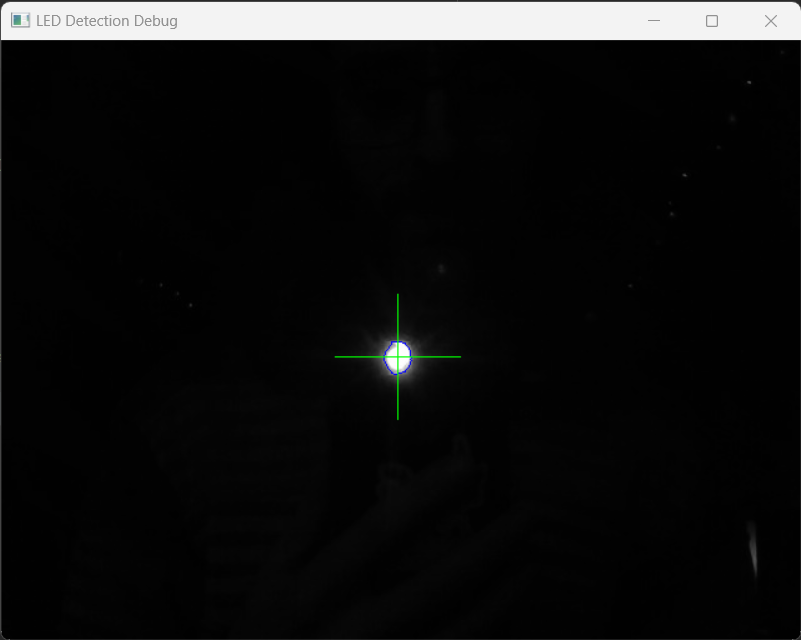

# L3D LED Mapper


This is a selection of tools to map LEDs into 2D and 3D space using only your webcam!

This works best in a dim environment so please make sure your camera isn't pointing at any other light sources! (Test in Step 1)

I really want to make this tool as good as it can get!

## Step 0: Install requirements
After downloading this repository, run `pip install -r requirements.txt`

This should install everything you need to run L3D.

## Step 1: Run the camera checker (recommended)
This will check your camera is compatible with L3D.

Run `python scripts/camera_check.py`

Test LED identification by turning down the lights and holding a torch or led up to the camera
This should start with few warnings, no errors and produce a **very** dark image 
with a single crosshair on centered on your LED:



You should see a single crosshair over your LED. 

Run `python scripts/camera_check.py --help` to list the optional parameters

## Step 2: Write your LED interface
Your LEDs are as unique as you are, 
so the fastest way to connect L3D to your system is to fill in the blanks in [backends/custom/custom_backend.py](backends/custom/custom_backend.py):

```python
class Backend:

    def __init__(self, led_count):
        self.led_count = led_count

    def set_led(self, led_index: int, on: bool):
        #  Make your LEDs do the on-off thing here!
```

If you prefer, there are also plans to support the below default backends. This can be selected in the next step using the `--backend` argument

| Backend   | Supported |
|-----------|-----------|
| fadecandy | yes       |
| lcm       | todo      |
| wled      | todo      |

If you implement a backend that you think others might use, please raise a pull request or just drop me a message on Telegram! 

## Step 3: Run the LED latency checker (recommended)
After writing / choosing your backend, place one of your addressable LEDs in front of your camera and run `python scripts/latency_check.py`

This checks that your backend is working properly and benchmarks the LED update speed which will be useful later.

The recommended latency will be listed in the console in milliseconds, note this down for later.

Run `python scripts/latency_check.py --help` to list the optional parameters

## Step 4: Capture a 2D map
Set up your LEDs in front of your camera and run `python scripts/capture_sequence.py --led_count 64 --output_dir my_scan`

Change `--led_count` to however many LEDs you want to scan and `--output_dir` to whatever folder you would like to export the 2D maps to.

If you have run Step 3, use the `--latency` argument followed by the recommended latency

This will produce timestamped CSV files with the following format:

```json lines
led_id, x, y
```

Run `python scripts/capture_sequence.py --help` to list the optional parameters

## Step 5: Reconstruct a 3D map
*TODO*

# Feedback

I would really love to hear what you think and if you have any bugs or improvements, please raise them here or drop me a line on [Telegram](https://t.me/themariday).