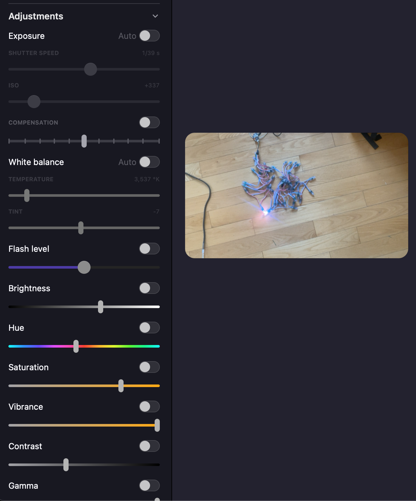
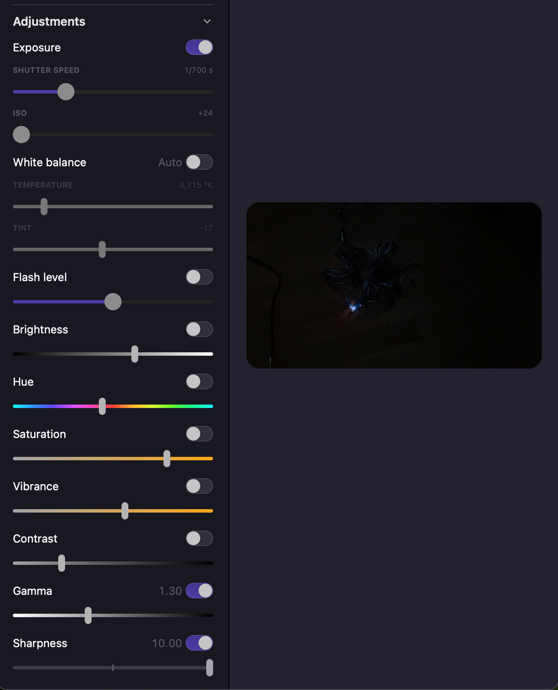

# PixelBlaze Backend Tutorial

The Pixelblaze backend will both attempt auto-discovering a Pixelblaze on the network,
as well as automatically set and render the necessary patterns for the mapping processes.

You can also manually supply the IP like with other backends, via the `--server` option
on various commands.

## Overview:

Test the Pixelblaze connection, you should see an LED blink:

```bash
marimapper_check_backend pixelblaze
marimapper_check_backend pixelblaze --help
```

Run the mapping process, moving the camera a bit in between each time, *.csv files will be created.
Hopefully eventually a reconstruction window will appear, in addition to the camera / dector window.
Use `--device <number>` if you want to try different cameras connected
(i.e. built in to laptop, USB web cams, software apps):

```bash
marimapper pixelblaze 
marimapper pixelblaze --help
```

For any backend, we can summarize the results with the following command.
Adding `--fill` is often good enough for basic LED mapping if you're struggling
to get completeness:
```bash
marimapper_results
marimapper_results --fill > filled_led_map_3d.csv
```

Uploading a completed 3d scan:
```bash
marimapper_upload_mapping_to_pixelblaze --csv_file led_map_3d.csv
```

Or with manual gap fill, plus `pb` CLI:
```bash
( echo '[' ; marimapper_results \
    | tail -n+2 | cut -d, -f 5-7 \
    | awk '{print (NR==1 ? "[" : "],[" ) $0 }' ; \
  echo ']]' ) | pb map
```

### Exposure Settings Examples

This tool comes with some mechanisms to adjust camera settings for optimal mapping,
however these don't always work across various hardware and platforms.

If you're on a Mac and have an iPhone, you can try the free [Camo](http://reincubate.com/camo/).

At first setup, things are often over exposed, especially in a daylit setting:


One goal is to darken (or increase the contrast) of the background verses lit LEDs.
After experimenting with exposure settings like aperture, shutter speed, gamma, sharpness, etc.,
we end up with an image that would make a bad family portrait, but great for a machine detecting
LED pixels:


### Manual Mapper File Alternative

You can alternatively manually upload the mapper file.

You can do this via the web UI by uploading [this file](https://github.com/TheMariday/marimapper/blob/main/marimapper/backends/pixelblaze/marimapper.epe)
as a new pattern.

Once this is done, run `marimapper_check_backend pixelblaze` to test it. It should cause LED 0 to blink.

Once you've checked your PixelBlaze setup is talking nicely with marimapper, you can go ahead and start mapping!

Once you're done, you can upload your 3D map to pixelblaze by running `marimapper_upload_mapping_to_pixelblaze` 
in the same folder as your `led_map_3d.csv`. 

Don't forget to add the `--server` argument if you've needed to change it in the previous steps.

### Happy Mappy!

Good luck!
Now you've learnt the PixelBlaze specifics, shoo! Back to the main [README.md](../../README.md) with you!